# stock-banner-svg-generator

An enterprise-grade, animated SVG generator for live stock and cryptocurrency market data. Designed specifically for embedding in GitHub profiles, GitLab READMEs, or any markdown environment that supports SVGs.



## Overview

`ticker-svg` transforms real-time market data into high-fidelity, CSS-animated SVG banners. Unlike static image generators, this service leverages native SVG animations and CSS transitions to provide a "dashboard" feel with minimal footprint and zero client-side JavaScript requirements for the end user.

### Technical Features

- **Staggered CSS Entrance**: Utilizes `cubic-bezier` timing functions to create a sophisticated, staggered entry effect for each ticker card.
- **Dynamic Clipping**: Employs SVG `<clipPath>` definitions to contain animations within precise card boundaries, ensuring a clean visual flow.
- **Micro-Animations**: Features a "breathing" opacity animation on the price change indicators to draw attention to market movements.
- **Dual-Layer Caching Strategy**:
  - **Global Cache**: A background worker refreshes default symbols (`RKLB`, `NVDA`, `NBIS`, `BTC/USD`) every 5 minutes.
  - **Dynamic Cache**: Custom symbol requests are cached locally with a TTL to optimize API credit usage while ensuring low-latency delivery.
- **Resilient Architecture**: Built-in fallback mechanism that serves stale cache data if the upstream API (Twelve Data) is unreachable.
- **Dark Mode Native**: Styled with a `#151515` background and high-contrast typography optimized for modern developer platforms.
- **XML Safe Rendering**: Automatically escapes special characters (like `&` in "AT&T") to ensure SVG validity across all platforms.
- **Theme Support**: Includes a built-in light theme for use on white backgrounds or light-themed documentation.

## Architecture

The service is built on a lightweight **Express.js** stack with **Node-Fetch** for data ingestion.

1. **Request**: User requests `/banner` or `/banner/SYMBOL1,SYMBOL2`.
2. **Cache Check**: System checks for valid local data.
3. **Data Ingestion**: If cache is missing/stale, it fetches from the **Twelve Data API**.
4. **SVG Engine**: The `buildBanner` function dynamically constructs an SVG string with per-card CSS keyframes and staggered delays.
5. **Response**: Delivers a `Content-Type: image/svg+xml` buffer with standard HTTP cache headers.

## Themes

The banner supports a `theme` query parameter to switch between dark and light modes.

- **Dark (Default)**: `?theme=dark`
- **Light**: `?theme=light`

## Examples

### Default Banner (Dark)
`GET /banner`

### Custom Banner (Light Theme)
`GET /banner/AAPL,MSFT,TSLA?theme=light`

### Crypto Tracker (Dark Theme)
`GET /banner/BTC/USD,ETH/USD,SOL/USD`

## Usage

### Development (Mock Mode)
To run the server with mock data and automatic reload on file changes:
```bash
npm run dev
```
Or for a single run:
```bash
node server.js
```

### Production (Real API)
To run the server with live market data from the Twelve Data API:
```bash
NODE_ENV=production node server.js
```

## Configuration

Create a `.env` file in the project root:

```env
PORT=3001
TWELVE_DATA_API_KEY=your_twelve_data_key
```

### Environment Variables
- `PORT`: The port the server will listen on (default: 3001).
- `TWELVE_DATA_API_KEY`: Your API key from Twelve Data.
- `NODE_ENV`: Set to `production` to enable live API fetching.

## Endpoints

### Default Ticker
`GET /banner`
Serves the pre-configured set of default stocks and crypto.

### Custom Ticker
`GET /banner/:symbols`
Example: `/banner/AAPL,MSFT,GOOGL,ETH/USD`
Request any symbol supported by Twelve Data. Note that cryptos use the `SYMBOL/USD` format.

## Deployment

### Systemd Integration
A `ticker-svg.service` file is included for robust Linux deployment.

```bash
sudo cp ticker-svg.service /etc/systemd/system/
sudo systemctl daemon-reload
sudo systemctl enable ticker-svg
sudo systemctl start ticker-svg
```

## License

[MIT](LICENSE)

---
Made with ❤️ by [jedbillyb](https://github.com/jedbillyb)