<div align="center">

# ticker-svg-generator

**Animated SVG stock and crypto banners for GitHub profiles and READMEs.**

[](./LICENSE)
[](https://nodejs.org)
[](https://expressjs.com)
[](https://twelvedata.com)


</div>

---

`ticker-svg` transforms live market data into CSS-animated SVG banners. Unlike static image generators, the output uses native SVG animations and CSS transitions — no client-side JavaScript required for the viewer.

## Features

- **Staggered entrance** — `cubic-bezier` timing functions animate each ticker card in sequence
- **Dynamic clipping** — SVG `<clipPath>` definitions keep animations within card boundaries
- **Breathing indicators** — Opacity micro-animation on price change indicators draws attention to movement
- **Dual-layer cache** — Global cache refreshes default symbols every 5 minutes; custom requests are TTL-cached separately to conserve API credits
- **Resilient fallback** — Serves stale cache data if the Twelve Data API is unreachable
- **6 themes** — Dark, light, matrix, sunset, dracula, and forest
- **XML-safe rendering** — Special characters (e.g. `&` in "AT&T") are automatically escaped for valid SVG output

---

## How It Works

1. **Request** — Client hits `/banner` or `/banner/SYMBOL1,SYMBOL2`
2. **Cache check** — Server checks for valid local data first
3. **Data fetch** — On cache miss or expiry, fetches from the Twelve Data API
4. **SVG engine** — `buildBanner` constructs an SVG string with per-card CSS keyframes and staggered delays
5. **Response** — Delivers `Content-Type: image/svg+xml` with standard HTTP cache headers

---

## Themes

Pass a `?theme=` query parameter to switch palettes.

| Dark (default) | Light |
|:---|:---|
|  |  |

| Matrix | Sunset |
|:---|:---|
|  |  |

| Dracula | Forest |
|:---|:---|
|  |  |

Available values: `dark` · `light` · `matrix` · `sunset` · `dracula` · `forest`

---

## API

**Default banner (dark)**
```
GET /banner
```

**Custom symbols with theme**
```
GET /banner/AAPL,MSFT,TSLA?theme=light
```

**Crypto tracker**
```
GET /banner/BTC/USD,ETH/USD,SOL/USD
```

---

## Usage

### Development (mock data)

```bash
DEV_MODE=true npm run dev
```

Runs with mock market data and auto-reloads on file changes — no API key needed.

### Production

```bash
npm start
```

Requires a valid `TWELVE_DATA_API_KEY` in `.env`.

### Environment Variables

```env
TWELVE_DATA_API_KEY=your_key_here
PORT=3000
DEV_MODE=false
STAGGER_DELAY_S=0.15
```

---

## Deployment

### systemd Service

```bash
sudo cp ticker-svg.service /etc/systemd/system/
sudo systemctl daemon-reload
sudo systemctl enable ticker-svg
sudo systemctl start ticker-svg

sudo journalctl -u ticker-svg -f
```

### Embedding in a README

```markdown


```

---

## License

MIT — see [LICENSE](LICENSE) for details.

---

<div align="center">
<sub>MIT © <a href="https://github.com/jedbillyb">jedbillyb</a> · Made with ❤️</sub>
</div>
